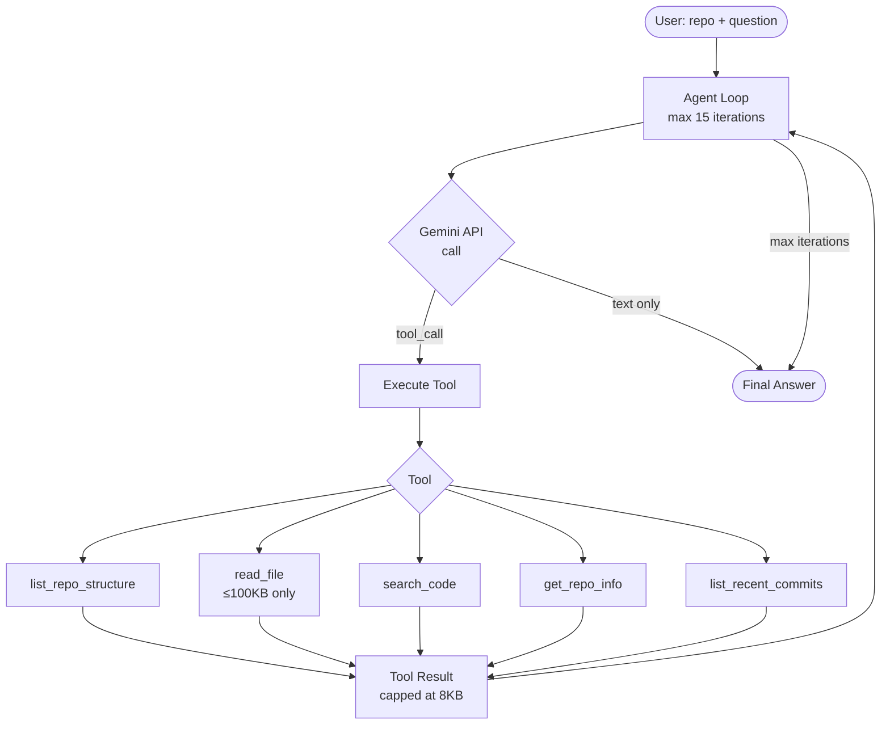

# Coding Research Agent 🤖

A from-scratch agent loop that reads GitHub repos and answers natural-language questions about their architecture. No LangChain. No LangGraph. Just the Gemini API and pure Python.

## Architecture



## How It Works

1. User provides a GitHub repo (`owner/repo`) and a question
2. Agent calls Gemini with the question + available tools
3. Gemini decides which tool to call (explore structure, read files, search code)
4. Tool result is fed back into the conversation
5. Loop repeats until Gemini gives a final text answer (no tool call)
6. Hard cap at **15 iterations** to prevent runaway loops

**Safety rules:**
- Files > 100 KB are refused (avoids burning tokens on minified bundles)
- Tool output capped at 8 KB (truncated with explicit message)
- Every tool call logged with full arguments

## Setup

```bash
git clone https://github.com/Mr-360-17/coding-agent.git
cd coding-agent
pip install -r requirements.txt
export GEMINI_API_KEY=your_key_here
```

## Usage

```bash
python agent.py --repo owner/repo --question "Your question here"
```

Or pass the key directly:
```bash
python agent.py --repo fastapi/fastapi --question "How is routing implemented?" --api-key YOUR_KEY
```

## 3 Worked Examples

### Example 1 — fastapi/fastapi

**Question:** What is the main entry point and how does FastAPI handle routing?

**Answer:**
> The main entry point is `fastapi/applications.py` which defines the `FastAPI` class inheriting from `Starlette`. Routing is handled via `fastapi/routing.py` — the `APIRouter` class wraps Starlette's router and adds dependency injection, response model validation, and OpenAPI schema generation. Routes are registered using decorators like `@app.get()`, `@app.post()` which internally call `add_api_route()`. Each route stores its dependencies and response model, resolved at request time by the `solve_dependencies()` function in `fastapi/dependencies/utils.py`.

**Files explored:** `fastapi/applications.py`, `fastapi/routing.py`, `fastapi/dependencies/utils.py`, `README.md`

---

### Example 2 — pallets/flask

**Question:** How does Flask handle request context and the `g` object?

**Answer:**
> Flask's request context is managed in `src/flask/ctx.py` via the `RequestContext` class. When a request arrives, `push()` is called which pushes the context onto a `LocalStack`. The `g` object is an instance of `_AppCtxGlobals` defined in `src/flask/ctx.py` — it's a simple namespace that lives for the duration of a single application context. It's accessible globally via `flask.g` because of the `LocalProxy` in `src/flask/globals.py` which looks up the current app context on every attribute access. This means `g` is automatically isolated per request without any threading concerns.

**Files explored:** `src/flask/ctx.py`, `src/flask/globals.py`, `src/flask/app.py`

---

### Example 3 — psf/requests

**Question:** How does the Session class manage connection pooling?

**Answer:**
> The `Session` class in `requests/sessions.py` manages connection pooling via `HTTPAdapter` objects stored in a `SessionRedirectMixin.mount()` dictionary. By default, two adapters are mounted — one for `https://` and one for `http://`. Each `HTTPAdapter` (in `requests/adapters.py`) wraps `urllib3`'s `PoolManager` which maintains a pool of `HTTPConnectionPool` objects keyed by host. The pool size is controlled by `pool_connections` (default 10) and `pool_maxsize` (default 10) parameters. When a request is made, `Session.send()` calls `get_adapter()` to find the right adapter by URL prefix, then the adapter reuses an existing connection from the pool if available.

**Files explored:** `requests/sessions.py`, `requests/adapters.py`, `requests/models.py`

---

## Tools

| Tool | Description | Limit |
|---|---|---|
| `list_repo_structure` | List files/dirs at a path | 8 KB output |
| `read_file` | Read file content | 100 KB file, 8 KB output |
| `search_code` | Search for patterns | 8 KB output |
| `get_repo_info` | Repo metadata | 8 KB output |
| `list_recent_commits` | Recent commit history | 8 KB output |

## Reflection

Building the agent loop from scratch makes it obvious why frameworks like LangChain exist — but also why they're overkill for focused tasks. The hardest parts were: (1) converting between message formats, (2) deciding when the agent has "enough" information, and (3) preventing token waste from large files. The 100 KB file limit and 8 KB output cap solve (3) cleanly.
